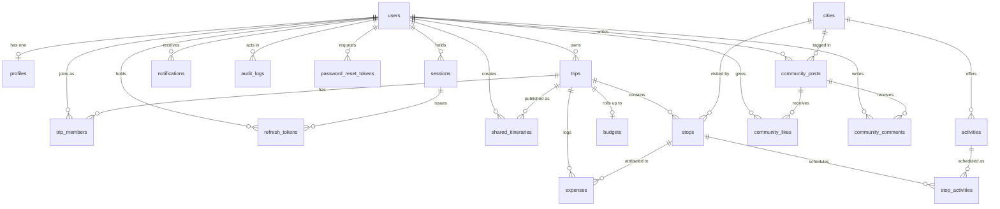

# GlobeTrotter — Database

Relational schema for the GlobeTrotter travel planning platform.

> **Single source of truth:** the authoritative schema is
> [`Backend/prisma/schema.prisma`](../Backend/prisma/schema.prisma). The files in
> this directory are a mirror kept for database review and documentation. If you
> change the schema, change it in `Backend/prisma/` and re-run the mirror, so the
> two never drift apart.

| File | Purpose |
| --- | --- |
| `schema.prisma` | Full Prisma model definitions (mirror) |
| `migrations/` | Ordered SQL migrations applied by `prisma migrate deploy` |
| `seed.ts` | Seed script — 61 cities, 263 activities, demo users and trips |
| `data/india.ts` | Static reference dataset (Indian cities + curated attractions) |

---

## Design rules

Every table follows the same conventions:

- **UUID primary key** (`gen_random_uuid()` via Prisma `@default(uuid())`) — safe
  to expose in URLs and generate client-side, unlike sequential integers.
- **`created_at` / `updated_at`** on every row, as `timestamptz`.
- **snake_case** column and table names in Postgres, camelCase in TypeScript.
- **Money as `NUMERIC(12,2)`**, never floating point. Amounts are converted to a
  2-decimal `number` exactly once, at the JSON boundary.
- **Dates that mean a calendar day** (trip start, stop arrival, expense date) use
  `date`, not `timestamptz`, so they never shift across timezones.

## Entity relationship diagram



## Tables

### Identity

| Table | Notes |
| --- | --- |
| `users` | Email is stored normalised (trimmed + lowercased) so uniqueness is real. Password is an Argon2id hash; plaintext never touches the database. |
| `profiles` | 1:1 with `users`, created at signup so no endpoint has to handle a missing profile. `saved_destinations` is a `text[]` of city ids. |
| `sessions` | One row per signed-in device. Revoking a session invalidates its access tokens immediately, which is what makes "log out all devices" instant. |
| `refresh_tokens` | Stores only the **SHA-256 digest** of the token. `replaced_by` links a rotated token to its successor so reuse is attributable. |
| `password_reset_tokens` | Also digest-only, single-use, one-hour expiry. |

### Trips

| Table | Notes |
| --- | --- |
| `trips` | Owned by one user; `travelers` and `currency` drive all budget arithmetic. |
| `trip_members` | Collaborators. The owner also gets a member row, so member queries need no special case. Unique on `(trip_id, user_id)`. |
| `stops` | One city visit. `sequence` is the drag-and-drop order, kept dense (0..n-1). Unique on `(trip_id, sequence)`. |
| `stop_activities` | Join table between a stop and a catalog activity, carrying trip-specific overrides (time, cost, duration) so the shared catalog is never mutated by one traveler. |

### Reference data

| Table | Notes |
| --- | --- |
| `cities` | Seeded catalog of 61 Indian destinations. `cost_index` (0-100) drives the cost filter and is scaled *within India* (Mumbai 85, Orchha 26) so the filter stays discriminating; `popularity` drives recommendations. Unique on `(name, country)`. |
| `activities` | Catalog of 263 real attractions, each belonging to one city, priced in INR at genuine entry-fee and tour rates. Unique on `(city_id, name)`. |

`cities` also carries the **rate bands the cost engine prices from** — three
nightly accommodation rates (`stay_budget` / `stay_mid` / `stay_luxury`), three
per-day meal rates, and `peak_months`, the months that destination is actually
in season. These are ordinary editable columns rather than constants in code
because an admin tunes them from the console, and because they are the seam
where a live pricing provider would be substituted later.

### Money

| Table | Notes |
| --- | --- |
| `budgets` | A deliberate rollup — one row per trip holding the latest computed totals, so the dashboard can read many trips' budgets without recomputing each. `BudgetService.recalculate()` is its only writer. |
| `expenses` | Individual logged amounts. Categorised so they fold into the same breakdown as itinerary-derived estimates. |

### Sharing and ops

| Table | Notes |
| --- | --- |
| `shared_itineraries` | Public read-only links. `slug` is generated from a CSPRNG (31^12 keyspace), not a sequential id, because it is the only thing protecting an unlisted itinerary. |
| `notifications` | In-app messages; `data` is a JSON payload for client deep-linking. |
| `audit_logs` | Append-only trail of auth, trip and admin actions. |

### Community

| Table | Notes |
| --- | --- |
| `community_posts` | Travel writeups, optionally tagged to a city and carrying a rating. `like_count` and `comment_count` are denormalised for feed ordering and are written in the same transaction as the like or comment row, so they cannot drift from the truth. |
| `community_likes` | Unique on `(post_id, user_id)` — the database, not the client, is what makes a like idempotent. |
| `community_comments` | Threaded under a post; deleted with it. |

## Cascade policy

Deleting a **user** removes everything they privately own — profile, tokens,
sessions, trips (and, through those, stops, scheduled activities, budget,
expenses and share links) and notifications.

Two deliberate exceptions:

- **`audit_logs.actor_id` is `ON DELETE SET NULL`.** The compliance trail
  outlives the account; nulling the actor satisfies erasure without destroying
  the record that something happened.
- **`stops.city_id` is `ON DELETE RESTRICT`.** Reference data must never be
  removed out from under a live itinerary.

`expenses.stop_id` is `SET NULL`, so deleting a stop keeps the money logged
against the trip rather than silently reducing its total.

## Indexes

Beyond the primary and unique keys, indexes exist on the columns the API
actually filters and sorts by:

- `trips (owner_id)`, `trips (start_date)`, `trips (status)` — the trip list and
  its upcoming/ongoing/past buckets.
- `stops (trip_id)`, `stops (city_id)` — itinerary assembly and popular-city
  analytics.
- `stop_activities (stop_id)`, `stop_activities (scheduled_date)` — day-wise
  timeline construction.
- `expenses (trip_id)`, `(category)`, `(incurred_on)` — budget breakdowns.
- `cities (country)`, `(region)`, `(popularity)` — city search and filters.
- `activities (type)`, `(popularity)` — activity search.
- `audit_logs (actor_id)`, `(action)`, `(created_at)` — the admin audit view.
- `notifications (user_id, read_at)` — the unread badge count.
- `community_posts (author_id)`, `(city_id)`, `(created_at)` — the feed and its
  group-by-destination and group-by-traveller views.

## Running it

From the `Backend/` directory:

```bash
npx prisma migrate deploy    # apply migrations
npx prisma db seed           # load cities, activities, demo users and trips
npx prisma studio            # browse the data
```

To regenerate this mirror after a schema change:

```bash
cp Backend/prisma/schema.prisma  Database/schema.prisma
cp Backend/prisma/seed.ts        Database/seed.ts
cp Backend/prisma/data/india.ts  Database/data/india.ts
rsync -a --delete Backend/prisma/migrations/ Database/migrations/
```

`rsync --delete` rather than `cp -r`, so a migration renamed or removed upstream
does not linger here and make the mirror look like a different history.

### Re-seeding over an existing database

The seed is idempotent, but replacing the catalog is not a plain upsert: a city
cannot be deleted while a stop still references it (`ON DELETE RESTRICT`, above).
`purgeLegacyCatalog()` therefore removes trips built on departing cities *first*,
then the cities, and finally prunes attractions that a surviving city no longer
lists — otherwise stale rows outlive the dataset that introduced them.
